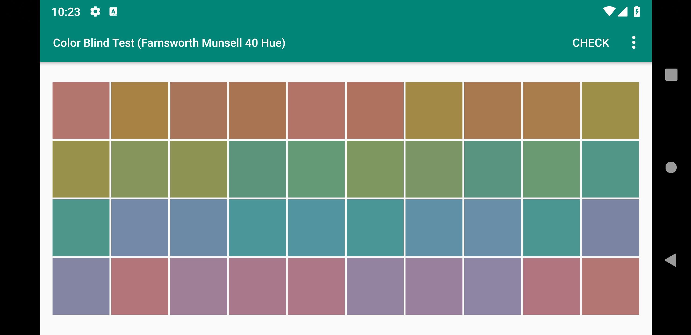
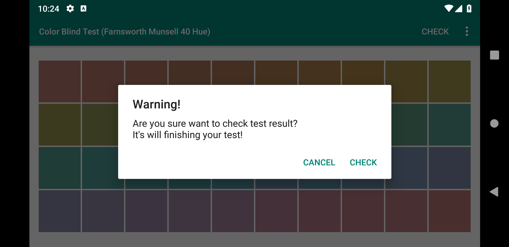
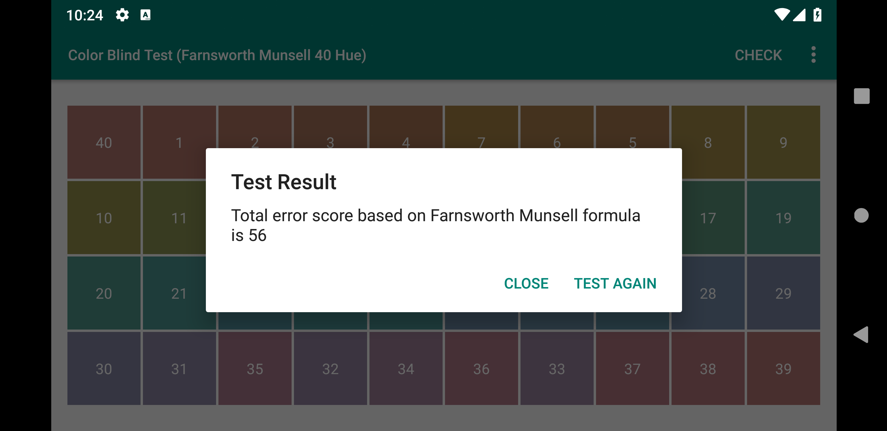
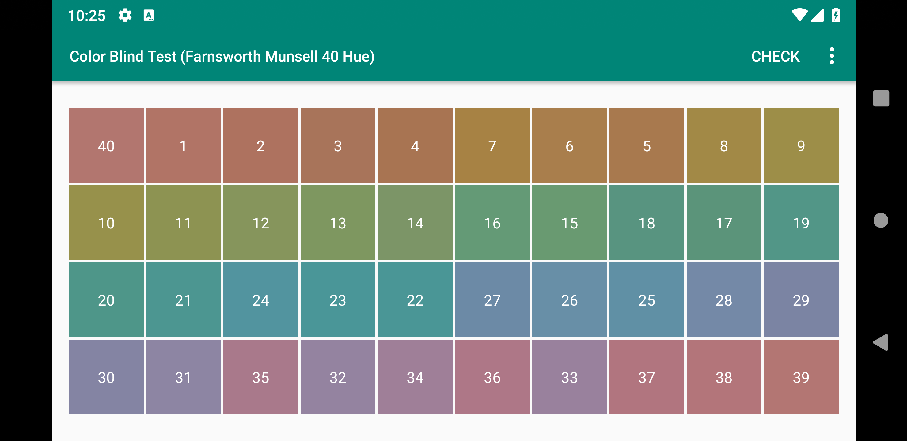
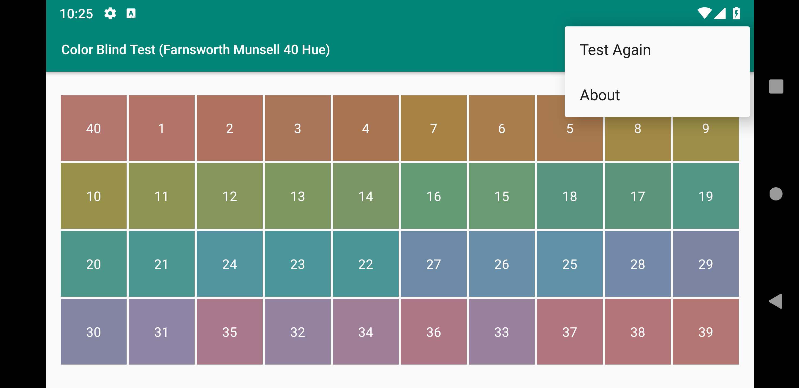

# Color Blind Test

This app is just for fun and learning purposes. Android application for color blind test using Farnsworth Munsell formula. It's just calculate error score based on formula, not implement what type of color blind at all.

## Screenshots

## References

- [Android Developer Docs](https://developer.android.com/docs)

- [The Farnsworth-Munsell 100-Hue Test for the examination of Color Discrimination by Dean Farnsworth revisied 1957](https://www.xritephoto.com/documents/literature/gmb/en/gmb_fm100_instructions_en.pdf)
